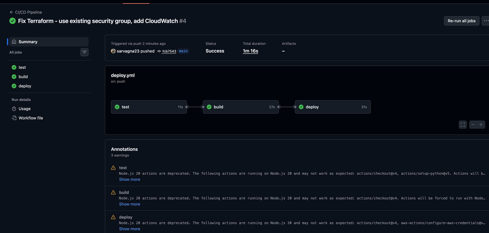

# CI/CD Automation Pipeline

Fully automated CI/CD pipeline using GitHub Actions, Docker, Terraform, and AWS EC2 with CloudWatch monitoring. Every push to main triggers automated testing, Docker build, and infrastructure deployment.

## Pipeline Status




## Pipeline Architecture
```
Push to GitHub
      ↓
GitHub Actions Triggered
      ↓
[1] Test Job — pytest (5/5 passing)
      ↓
[2] Build Job — Docker build + container test
      ↓
[3] Deploy Job — Terraform provisions AWS EC2
      ↓
CloudWatch monitoring + CPU alerts
```

## Results
- **Tests:** 5/5 passing
- **Pipeline duration:** ~1m 16s end-to-end
- **Infrastructure:** Terraform-provisioned AWS EC2
- **Monitoring:** CloudWatch log group + CPU alarm at 80%
- **Trigger:** Every push to main branch

## Tech Stack
- **CI/CD:** GitHub Actions
- **Containerization:** Docker
- **Infrastructure as Code:** Terraform
- **Cloud:** AWS EC2
- **Monitoring:** AWS CloudWatch
- **Testing:** pytest
- **API:** FastAPI, Python

## Project Structure
```
cicd-pipeline/
├── app/
│   └── main.py              # FastAPI application
├── tests/
│   └── test_app.py          # pytest test suite (5/5)
├── terraform/
│   ├── main.tf              # EC2 + CloudWatch provisioning
│   ├── variables.tf         # Input variables
│   └── outputs.tf           # Output values
├── .github/
│   └── workflows/
│       └── deploy.yml       # GitHub Actions CI/CD workflow
├── Dockerfile
└── docker-compose.yml
```

## GitHub Actions Workflow

```yaml
# Triggered on every push to main
test → build → deploy
```

- **test:** Installs dependencies, runs pytest
- **build:** Builds Docker image, runs container health check
- **deploy:** Configures AWS credentials, runs Terraform to provision EC2 + CloudWatch

## Terraform Infrastructure

Provisions on every deployment:
- AWS EC2 t3.micro instance
- CloudWatch log group (`/cicd-pipeline/api`)
- CloudWatch CPU alarm (threshold: 80%)

## Local Development

```bash
git clone https://github.com/sarvagna23/cicd-pipeline.git
cd cicd-pipeline
python3 -m venv venv && source venv/bin/activate
pip install -r requirements.txt
python3 app/main.py
```

## API Endpoints

```bash
curl http://localhost:8000/health
curl http://localhost:8000/metrics
curl -X POST http://localhost:8000/predict \
  -H "Content-Type: application/json" \
  -d '{"value": 0.8}'
```

## Docker

```bash
docker build -t cicd-pipeline-api .
docker run -p 8000:8000 cicd-pipeline-api
```